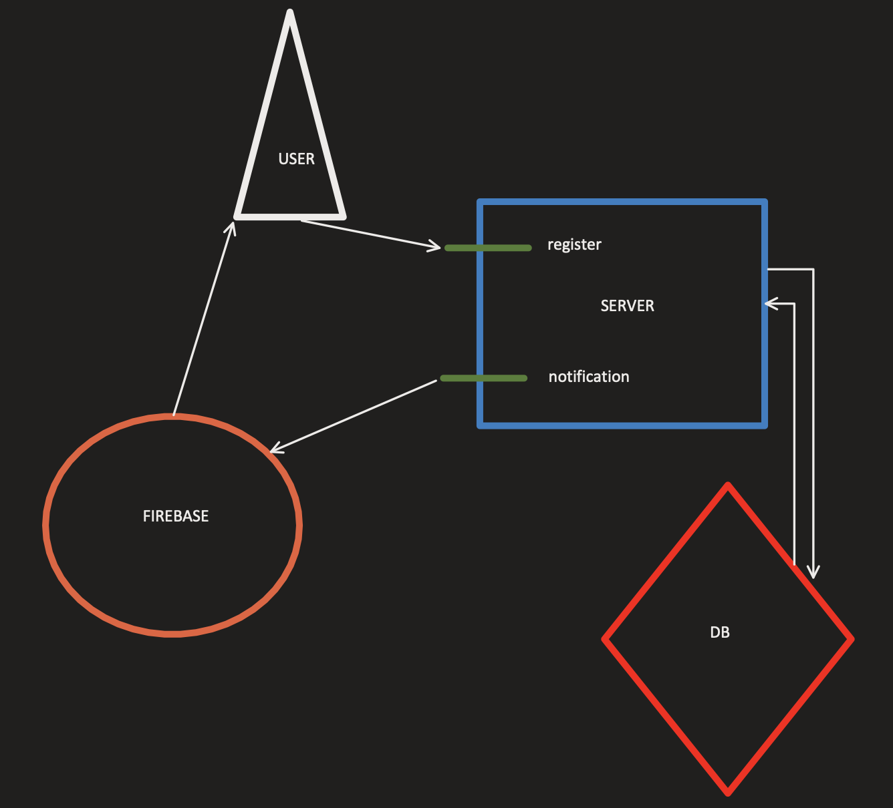

# E-Wallet

## Environment setup

###  EXPO

Install Expo globally

`npm i -g expo-cli`

Navigate into the directory and install dependencies

`npm install`

Install Expo application on your smartphone

Run `npm start`

Scan QR code using cellphone and build the app

## Architecture

First draft (In case of architecture using OPTION 1)

Draft using expo setup and notifications

### Notifications

## Wireframes

## Database Model
